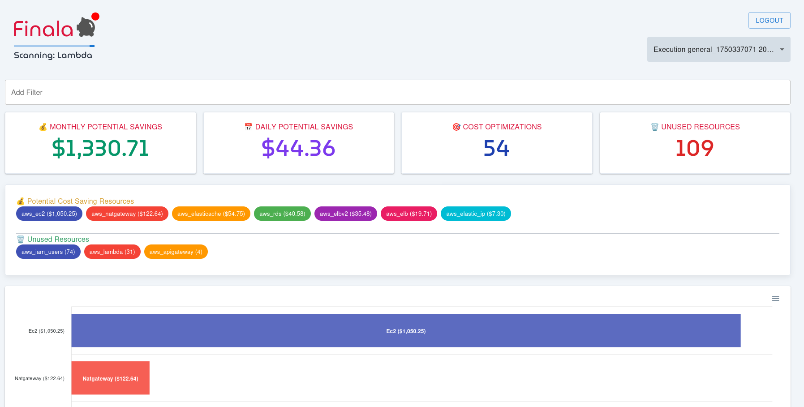

# Finala

## Overview

Finala is an open-source cloud resource scanner that analyzes, discloses, presents, and notifies about wasteful and unused resources across your cloud infrastructure. It helps organizations achieve two primary objectives: **cost optimization** and **unused resource detection**.

Finala provides comprehensive visibility into your cloud spending by identifying resources that are either underutilized or completely unused, enabling you to make informed decisions about resource optimization and cost reduction.

## Features

### 🔍 **Resource Discovery & Analysis**
- **Cloud Provider Support**: Currently supports AWS with extensible architecture designed for multi-cloud expansion
- **Comprehensive Resource Coverage**: Analyzes 18+ AWS services including EC2, RDS, Lambda, DynamoDB, and more
- **Intelligent Detection**: Uses CloudWatch metrics and custom rules to identify underutilized resources
- **Cost Impact Analysis**: Calculates potential cost savings for each identified resource

### 🎯 **Smart Detection Engine**
- **YAML-Based Configuration**: Easy-to-understand resource definitions using high-level YAML syntax
- **Customizable Rules**: Tailor detection criteria to match your infrastructure patterns and usage habits
- **Metric-Based Analysis**: Leverages CloudWatch metrics with configurable thresholds and time periods
- **Formula Support**: Advanced mathematical expressions for complex resource evaluation

### 🖥️ **Modern Web Interface**
- **React-Based UI**: Modern, responsive web interface built with React 18 and Material-UI v5
- **Real-Time Dashboard**: Interactive charts and visualizations of resource utilization
- **Advanced Filtering**: Filter resources by tags, regions, services, and cost thresholds
- **Search Capabilities**: Powered by Meilisearch for fast, relevant resource discovery

### 🔐 **Security & Authentication**
- **JWT-Based Authentication**: Secure login system with token-based authentication
- **Protected Routes**: Role-based access control for sensitive resource information
- **Auto-Generated Credentials**: Secure default setup with customizable authentication

### 📊 **Reporting & Notifications**
- **Scheduled Notifications**: Configure automated alerts via Slack or email
- **Tag-Based Filtering**: Group and notify based on resource tags and cost thresholds
- **Customizable Reports**: Generate reports based on specific criteria and time periods

### 🚀 **Easy Deployment**
- **Docker Compose**: One-command deployment with pre-configured services
- **Production Ready**: Optimized Docker images for both development and production
- **Scalable Architecture**: Microservices-based design for horizontal scaling

## Supported AWS Services

| Service | Cost Optimization | Unused Detection |
|---------|------------------|------------------|
| API Gateway | ❌ | ✅ |
| DocumentDB | ✅ | ❌ |
| DynamoDB | ✅ | ❌ |
| EC2 ALB/NLB | ✅ | ❌ |
| EC2 Elastic IPs | ✅ | ❌ |
| EC2 ELB | ✅ | ❌ |
| EC2 NAT Gateways | ✅ | ❌ |
| EC2 Instances | ✅ | ❌ |
| EC2 Volumes | ✅ | ❌ |
| ElastiCache | ✅ | ❌ |
| Elasticsearch | ✅ | ❌ |
| IAM Users | ❌ | ✅ |
| Kinesis | ✅ | ❌ |
| Lambda | ❌ | ✅ |
| Neptune | ✅ | ❌ |
| RDS | ✅ | ❌ |
| Redshift | ✅ | ❌ |

## Documentation

- **[Quick Start Guide](docs/quick-start.md)** - Get Finala up and running quickly
- **[Installation Guide](docs/installation.md)** - Comprehensive installation scenarios
- **[Configuration Guide](docs/configuration.md)** - Complete configuration reference
- **[Architecture Overview](docs/architecture.md)** - System design and components
- **[AWS Setup](docs/aws-setup.md)** - AWS permissions and configuration
- **[API Reference](docs/api-reference.md)** - REST API documentation
- **[Troubleshooting](docs/troubleshooting.md)** - Common issues and solutions

## Screenshots

## License

This project is licensed under the MIT License - see the [LICENSE](LICENSE) file for details.

## Recent Updates

### v2.0+ Major Improvements
- **Search Backend**: Migrated from Elasticsearch to Meilisearch for improved performance
- **Go Version**: Upgraded to latest Go version with enhanced security
- **Frontend Modernization**: React 18, Material-UI v5, React Router v6
- **Authentication**: Added JWT-based authentication system
- **Containerization**: Optimized Docker images and build processes
- **Dependencies**: Updated all packages to latest stable versions

## Support

- **Issues**: Report bugs and request features via [GitHub Issues](https://github.com/qburst/finala/issues)
- **Discussions**: Join community discussions in [GitHub Discussions](https://github.com/qburst/finala/discussions)
- **Security**: Report security vulnerabilities via [GitHub Security](https://github.com/qburst/finala/security/advisories) 
