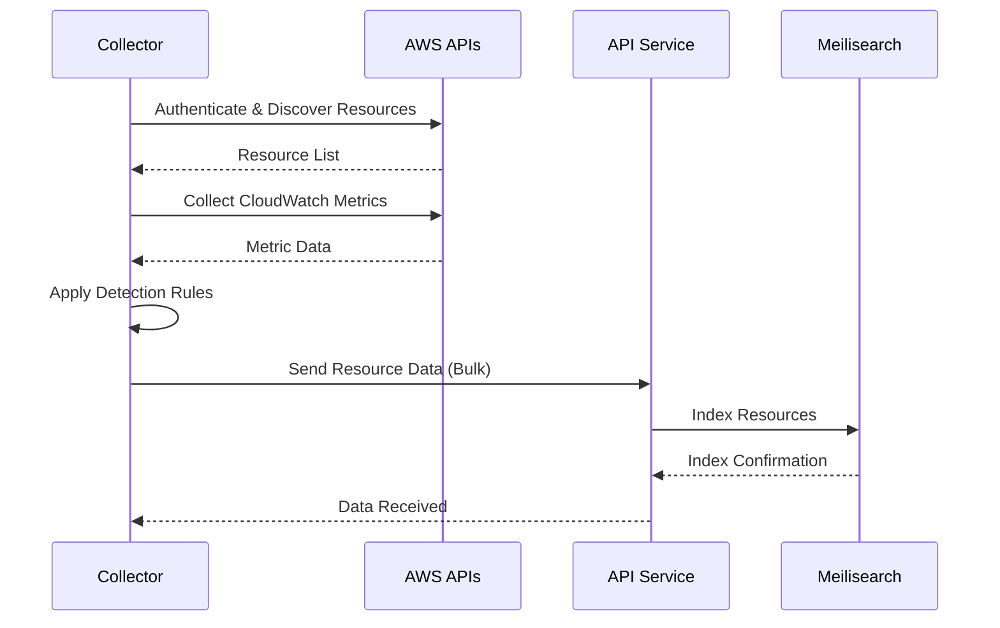
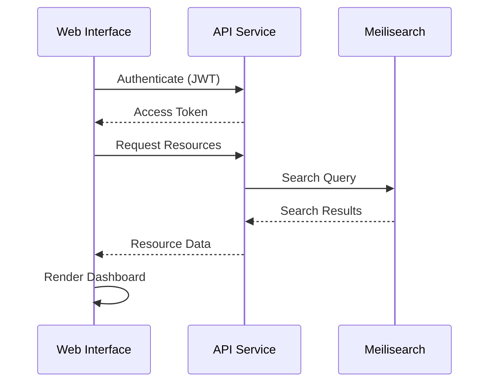
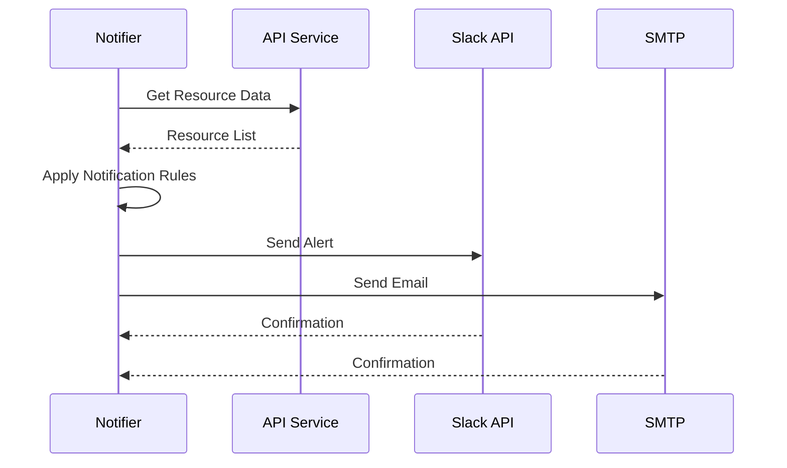
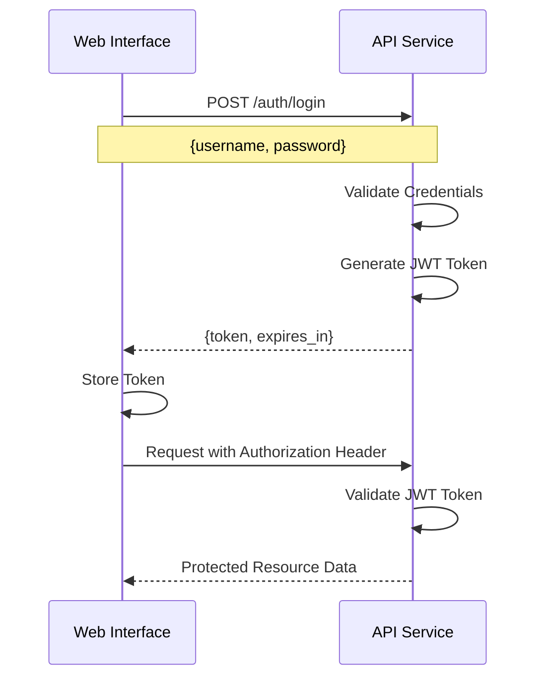

# Architecture Overview

Finala follows a microservices architecture designed for scalability, maintainability, and extensibility. This document provides a detailed overview of the system architecture, components, and data flow.

## System Architecture

```
┌─────────────────┐    ┌─────────────────┐    ┌─────────────────┐
│   AWS Cloud     │    │   Finala API    │    │  Web Interface  │
│   Resources     │◄──►│   (Go/HTTP)     │◄──►│   (React/MUI)   │
└─────────────────┘    └─────────────────┘    └─────────────────┘
                              │
                              ▼
                       ┌─────────────────┐
                       │   Meilisearch   │
                       │   (Search DB)   │
                       └─────────────────┘
                              ▲
                              │
                       ┌─────────────────┐
                       │   Collector     │
                       │   (Go/AWS SDK)  │
                       └─────────────────┘
                              │
                              ▼
                       ┌─────────────────┐
                       │   Notifier      │
                       │   (Slack/Email) │
                       └─────────────────┘
```

## Core Components

### 1. Collector Service

The Collector is responsible for discovering and analyzing AWS resources.

**Technology Stack:**
- **Language**: Go
- **AWS SDK**: AWS SDK for Go v2
- **Configuration**: YAML-based rules engine

**Responsibilities:**
- Scan AWS accounts and regions
- Collect CloudWatch metrics
- Apply detection rules
- Calculate cost savings
- Send data to API service

**Key Features:**
- Multi-account support
- Configurable detection rules
- Metric-based analysis
- Formula evaluation engine
- Bulk data processing

**Data Flow:**
1. Reads configuration from `collector.yaml`
2. Authenticates with AWS using configured credentials
3. Iterates through accounts and regions
4. Collects resource metadata and CloudWatch metrics
5. Applies detection rules and formulas
6. Sends results to API service in batches

### 2. API Service

The API provides a RESTful interface for data access and management.

**Technology Stack:**
- **Language**: Go
- **Framework**: Standard library `net/http` with Go 1.22+ ServeMux
- **Authentication**: JWT-based
- **Storage**: Meilisearch integration

**Responsibilities:**
- REST API endpoints
- Authentication and authorization
- Data storage and retrieval
- Search functionality
- Email notifications

**Key Endpoints:**
- `GET /api/v1/resources` - List resources
- `GET /api/v1/resources/{id}` - Get resource details
- `POST /api/v1/auth/login` - Authentication
- `GET /api/v1/statistics` - Dashboard statistics
- `GET /api/v1/tags` - Resource tags

**Security Features:**
- JWT token authentication
- Protected routes
- Configurable credentials
- Auto-generated secure passwords

### 3. Web Interface (UI)

The UI provides a modern, responsive web interface for resource management.

**Technology Stack:**
- **Framework**: React 18
- **UI Library**: Material-UI v5
- **Routing**: React Router v6
- **State Management**: Redux
- **Build Tool**: Webpack 5

**Key Features:**
- Interactive dashboard
- Resource filtering and search
- Cost analysis charts
- Tag-based organization
- Responsive design

**Components:**
- Dashboard with statistics
- Resource table with filtering
- Charts and visualizations
- Authentication forms
- Settings and configuration

### 4. Search Engine (Meilisearch)

Meilisearch provides fast, relevant search capabilities.

**Technology Stack:**
- **Engine**: Meilisearch v1.7
- **Storage**: Persistent volumes
- **API**: RESTful search API

**Features:**
- Fast full-text search
- Typo tolerance
- Faceted search
- Real-time indexing
- Configurable relevance

### 5. Notifier Service

The Notifier handles automated alerts and notifications.

**Technology Stack:**
- **Language**: Go
- **Channels**: Slack, Email
- **Scheduling**: Configurable intervals

**Responsibilities:**
- Monitor resource data
- Apply notification rules
- Send alerts via configured channels
- Tag-based filtering

## Data Flow

### Resource Collection Process



### Web Interface Data Flow



### Notification Process



## Storage Architecture

### Meilisearch Index Structure

```json
{
  "resource_id": "i-1234567890abcdef0",
  "name": "web-server-01",
  "service": "ec2",
  "region": "us-east-1",
  "account": "production",
  "cost": 45.67,
  "tags": {
    "Environment": "production",
    "Team": "engineering"
  },
  "metrics": {
    "cpu_utilization": 15.5,
    "connection_count": 0
  },
  "detection_rules": [
    {
      "description": "Low CPU utilization",
      "status": "detected"
    }
  ],
  "created_at": "2024-01-15T10:30:00Z",
  "updated_at": "2024-01-15T10:30:00Z"
}
```

### Data Persistence

- **Meilisearch Data**: Stored in Docker volumes
- **Configuration**: YAML files mounted as volumes
- **Logs**: Docker log drivers
- **Temporary Data**: In-memory processing

## Security Architecture

### Authentication Flow



### Security Features

1. **JWT Authentication**
   - Token-based authentication
   - Configurable expiration
   - Secure token storage

2. **AWS Credentials**
   - Support for IAM roles
   - Temporary credentials
   - Environment variable injection

3. **Network Security**
   - Internal Docker networking
   - Port exposure control
   - Service-to-service communication

4. **Data Protection**
   - No sensitive data in logs
   - Encrypted storage (Meilisearch)
   - Secure configuration management

## Scalability Considerations

### Horizontal Scaling

**API Service:**
- Stateless design
- Load balancer support
- Connection pooling

**Collector Service:**
- Account-based partitioning
- Region-based distribution
- Configurable batch sizes

**Meilisearch:**
- Master-slave replication
- Sharding support
- Backup and restore

### Performance Optimization

1. **Bulk Operations**
   - Batch resource processing
   - Configurable intervals
   - Efficient API calls

2. **Caching**
   - Meilisearch caching
   - Browser caching
   - API response caching

3. **Resource Management**
   - Memory limits
   - CPU allocation
   - Network bandwidth

## Monitoring and Observability

### Logging

- **Structured Logging**: JSON format
- **Log Levels**: Debug, Info, Warn, Error
- **Service Identification**: Component tags
- **Request Tracing**: Correlation IDs

### Metrics

- **Resource Collection**: Success/failure rates
- **API Performance**: Response times, throughput
- **Search Performance**: Query latency
- **System Resources**: CPU, memory, disk

### Health Checks

- **Service Health**: Docker health checks
- **Dependency Health**: AWS API connectivity
- **Data Health**: Meilisearch availability
- **Configuration Health**: YAML validation

## Deployment Architecture

### Docker Compose Structure

```yaml
services:
  meilisearch:
    # Search engine with persistent storage
    
  api:
    # REST API service
    depends_on: [meilisearch]
    
  ui:
    # Web interface
    depends_on: [api]
    
  collector:
    # Resource collection
    depends_on: [api]
    
  notifier:
    # Notifications (optional)
    depends_on: [api]
```

### Production Considerations

1. **High Availability**
   - Service redundancy
   - Load balancing
   - Failover mechanisms

2. **Data Backup**
   - Meilisearch snapshots
   - Configuration backups
   - Log retention

3. **Security**
   - Network isolation
   - Secret management
   - Access controls

4. **Monitoring**
   - Application metrics
   - Infrastructure monitoring
   - Alert management

## Extensibility

### Adding New Cloud Providers

1. **Provider Interface**: Implement collector interface
2. **Resource Types**: Define resource structures
3. **Metrics Collection**: Implement provider-specific APIs
4. **Configuration**: Add provider configuration schema

### Adding New Resource Types

1. **Resource Definition**: Define resource structure
2. **Collection Logic**: Implement resource discovery
3. **Metrics Integration**: Add CloudWatch metrics
4. **Detection Rules**: Configure detection criteria

### Custom Notifications

1. **Notification Provider**: Implement notifier interface
2. **Configuration**: Add notification settings
3. **Integration**: Connect to external systems
4. **Templates**: Define message formats

## Future Enhancements

### Planned Features

1. **Multi-Cloud Support**
   - Azure integration
   - Google Cloud Platform
   - Kubernetes resources

2. **Advanced Analytics**
   - Cost forecasting
   - Trend analysis
   - Anomaly detection

3. **Enhanced UI**
   - Custom dashboards
   - Advanced filtering
   - Export capabilities

4. **Integration Ecosystem**
   - Webhook support
   - API integrations
   - Third-party tools 